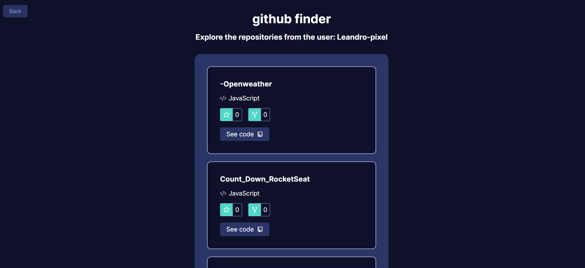

# (Github finder)

This is a [Github Finder](project link). 

## Table of contents

- [Overview](#overview)
  - [The purpose](#The-purpose)
  - [Screenshot](#screenshot)
- [My process](#my-process)
  - [Built with](#built-with)
- [Author](#author)

## Overview

### The-purpose

Users should be able to:

- Search and find user profiles on github
- See their data and their best projects

### Screenshot

## My process

### Built with

- Semantic HTML5 markup
- CSS custom properties
- Fetch for API
- React-router-dom
- React-icons
- Typescript
- [React](https://reactjs.org/) - JS library

## Author

- Website - [Leandro](https://leandro-pixel.github.io/React-Portfolio/)
- Linkdin - [@Leandro-Soares-Neves](https://www.linkedin.com/in/leandro-soares-neves/)

